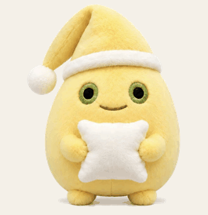
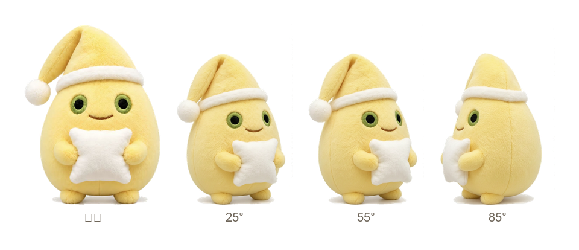

# 奶蛋桌宠 · NaiDan Pet

一只趴在屏幕上的桌宠，形象是我自己那只抱枕小玩偶「奶蛋」。



它会自己呼吸、眨眼、沿屏幕底边散步，可以用鼠标拎着走，点一下会弹一下。

## 下载

Windows x64 免安装单文件（约 46 MB，不需要装 Python）：

**→ [Releases / NaiDanPet.exe](https://github.com/trixster2/nai-dan-pet/releases/latest)**

> 双击即运行。程序没有做代码签名，首次启动 Windows 可能弹 SmartScreen 提示，
> 点「仍要运行」即可。

## 怎么玩

| 操作 | 反应 |
| --- | --- |
| 按住拖动 | 拎着走，身体顺势倾斜拉长 |
| 单击 | 弹一下 |
| 右键 | 菜单：走动 / 停下 / 大小（小·中·大）/ 回到右下角 / 退出 |
| 什么都不做 | 自己呼吸、眨眼，隔一会儿换成侧身帧沿底边散步，撞到屏幕边缘回头 |

## 从源码运行

```bash
pip install PySide6
python make_sprites.py     # 从 assets/ 生成 sprites/
python make_blink.py       # 生成眨眼帧
python pet.py              # 启动
```

## 形象是怎么从实拍照片变成桌宠的

素材不是画的，是那只玩偶的实拍图抠出来的。难点在于它**本身就是奶油色**——
白帽檐、白抱枕，和摄影棚的纯白背景在亮度上几乎一样，按亮度阈值抠会把帽檐啃掉一块。

可用的判据是色相中性度：背景是 `255,255,255` 的纯中性白，
而白绒毛是偏黄的（r−b 差约 45）。从边界做泛洪时只认「三通道极差 ≤ 7」的像素为背景，
帽檐和绒球就都保住了。脚本在 `make_sprites.py`。

眨眼帧同样是程序生成的：定位虹膜那圈绿色绣线（判据 `g > r`，
否则黄色绒毛会被误判成绿色），用眼睛**外圈**的绒毛中位色补掉眼球，再画一条下弯的眼线。
取色用外圈而不是从额头搬一块补丁，是因为外圈的光照和眼周一致，不会留出色差。
脚本在 `make_blink.py`。

桌宠一共用四帧：正面 + 三个转角（约 25°/55°/85°），散步时换成侧身那帧。



`docs/` 里的预览 GIF 是按 `pet.py` 同一套运动参数渲染的，不是另外做的一条动画。

## 跨平台

只用 PySide6，没有平台专用代码。

- **Windows**：完全正常，打包脚本 `python build_exe.py`。
- **macOS / Linux(X11)**：同一份 `pet.py` 直接跑。
- **Linux** 需要合成器（KDE / GNOME 默认都有）才有透明效果。
- **Wayland** 下窗口管理器可能不允许置顶与绝对定位，这是协议限制，不是本项目的 bug。

## 关于那只玩偶

它抱着一整个枕头，帽尖垂着一颗手绘白绒球。名字来源于配色——奶黄的蛋形身体。
